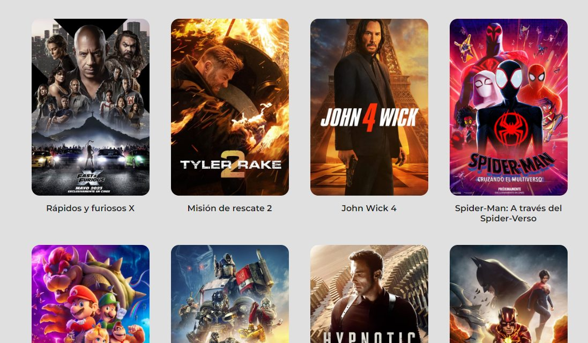

# ScrollInfinito CON FETCH.

Link API REST TMDB: https://developer.themoviedb.org/docs

# Targets

* Uso de Fetch para traer datos de una API REST y aplicar Scroll Infinito con Observadores.

## Screenshot

